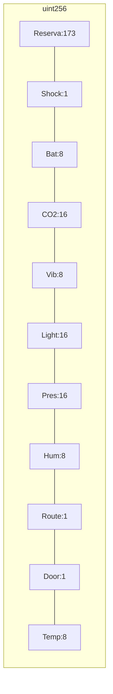
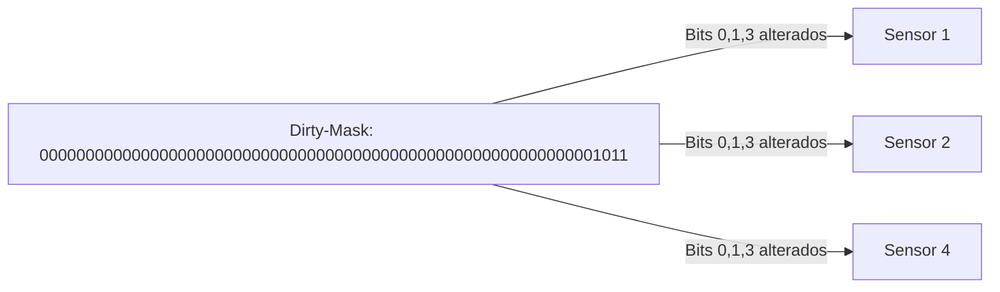
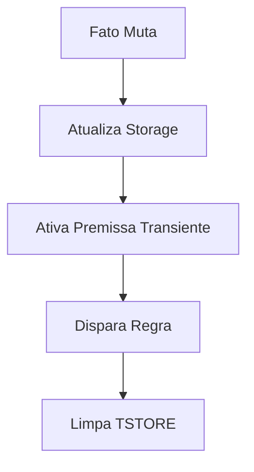

# 3. A Arquitetura Proposta: PON Hyper-Fused

## Mapa de Memória dos Sensores (Bit-Packing)

Figura 1 - Layout de bit-packing dos sensores em um uint256:



## Dirty-Mask

Figura 2 - Exemplo de Dirty-Mask indicando sensores alterados:



## Fluxograma do PON Hyper-Fused

Figura 3 - Fluxo de processamento no Paradigma PON Hyper-Fused:



## Compressão de Estado (Footprint $O(1)$)

Para garantir máxima eficiência, todos os sensores (Temp, Door, Shock, etc.) são compactados em um único `uint256` chamado `packedFacts`. O layout é cuidadosamente planejado, atribuindo a cada sensor um range de bits específico:

- **Layout:** `[Reserva: 173][Shock:1][Bat:8][CO2:16][Vib:8][Light:16][Pres:16][Hum:8][Route:1][Door:1][Temp:8]`

Visualmente, imagine um bloco de 256 bits onde cada fatia representa um sensor diferente. Por exemplo, a temperatura ocupa os bits 0-7, a porta o bit 8, e assim por diante. Isso permite atualizar ou consultar qualquer sensor individualmente, sem afetar os demais, usando máscaras e deslocamentos bit a bit.

```solidity
// Exemplo de atualização de temperatura (bits 0-7)
let oldTemp := and(currentPacked, 0xFF)
if iszero(eq(and(_temp, 0xFF), oldTemp)) {
    newPacked := or(and(newPacked, not(0xFF)), and(_temp, 0xFF))
    dirtyMask := or(dirtyMask, 0x01)
}
```

## O Motor de Inferência em Yul (Assembly)

O processamento de mudanças e inferência de regras é realizado em Assembly (Yul), permitindo bypassar limitações do compilador Solidity e operar diretamente sobre os bits:

- **Dirty-mask:** Uma máscara de bits indica quais sensores mudaram na transação.
- **Inferência:** Cada regra é avaliada bit a bit, usando operações como `and`, `shr`, `sgt`, etc.

```solidity
// Exemplo de regra: Temp crítica (> -50) e Porta aberta
if and(dirtyMask, 0x03) {
    let tempVal := signextend(0, and(newPacked, 0xFF))
    if and(sgt(tempVal, sub(0, 50)), and(shr(8, newPacked), 0x01)) {
        _emitEvent("Critical: Temp/Door Violation", 27)
    }
}
```

Esse motor permite avaliar múltiplas regras de forma eficiente, sem loops ou estruturas de alto nível, maximizando a performance.

## Prevenção de Gatilho Duplo (Composabilidade)

Para garantir que uma mesma regra composta (ex: Temp alta + Porta aberta) não dispare duas vezes na mesma transação, utiliza-se a memória transiente (EIP-1153):

- **Dirty-mask transiente:** O dirty-mask é salvo em um slot transiente via `tstore` e limpo ao final da execução (`tstore(slot, 0)`).
- **Atomicidade:** Isso garante que cada regra só possa ser disparada uma vez por transação, mesmo em execuções compostas ou recursivas.

```solidity
// Armazenamento e limpeza do dirty-mask em slot transiente
let slot := 0xb94d4bb16ee2057a0f1dbc2eb186c5e6831f88891da96b5b733f1c9363346d51
tstore(slot, dirtyMask)
// ...
tstore(slot, 0)
```

Essa abordagem elimina efeitos colaterais e garante a composabilidade segura das regras de inferência.
